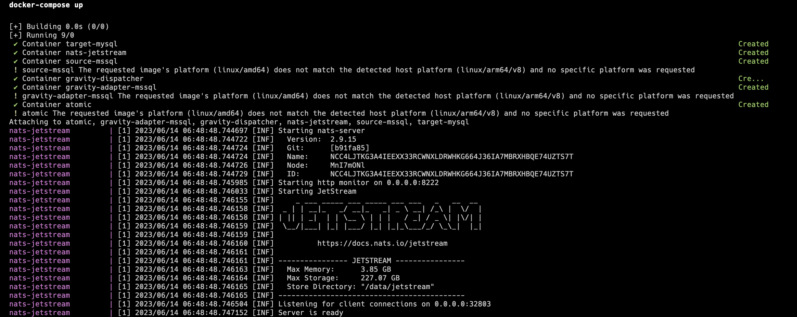
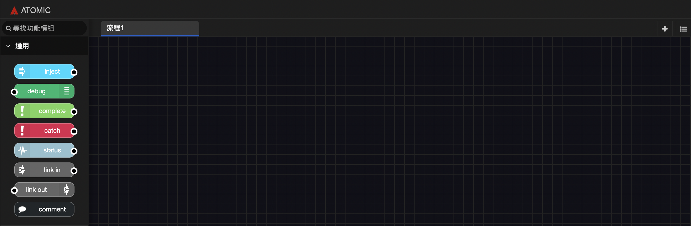

# Your first Data Product

In this example, we will guide you through a quick start with Gravity. The task at hand is to funnel data from a source database (Source) through an Adapter into Gravity, and then create a Data Product, which is written into a heterogeneous target database (Target).

For this example, we have chosen MSSQL and MySQL as the two databases for heterogeneous replication. Please download the relevant files for the Quick Start first.

## Create Gravity Container Cluster
``` shell
git clone https://github.com/BrobridgeOrg/gravity-quickstart
cd gravity-quickstart
docker-compose up
```


## Cluster Description
This completes the deployment of this Quick Start, which will launch a total of 6 containers. Here are the detailed descriptions of their uses:

| Container             | Purpose                               | Port  |
|-----------------------|---------------------------------------|-------|
| source-mssql          | Simulates the source database         | 31433 |
| target-mysql          | Simulates the target database for replication | 33306 |
| nats-jetstream        | Event Store for the gravity-dispatcher | 32803 |
| gravity-dispatcher    | Event handling and distribution for Data Product | N/A   |
| gravity-adapter-mssql | Component for MSSQL Change Data Capture (CDC) | N/A   |
| atomic                | User interface for visual logic processing | 1880  |

## Source Database
In this example, we have created an Accounts Table in MSSQL. This table is like any other table we would use for any service.
``` SQL
CREATE TABLE Accounts (
  id INT, 
  name NVARCHAR(50), 
  phone NVARCHAR(16)
);
```
## Target Database
In the target database, we also need to set up the schema. In this example, we are using MySQL, so the syntax will have some differences compared to the source database. Here is a schema example.
``` SQL
CREATE TABLE `Accounts` (
    `id` int(16) NOT NULL,
    `name` varchar(50) CHARACTER SET utf8 DEFAULT NULL,
    `phone` varchar(16) CHARACTER SET utf8 DEFAULT NULL
) ENGINE=InnoDB DEFAULT CHARSET=utf8mb4;
```

## Adapter
In order to achieve heterogenous replication, we will enable the Change Data Capture (CDC) functionality of the source database and use the Adapter component to store CDC events in JetStream. Although in this example, we only demonstrate with MSSQL, in fact, we provide many different adapters for users to choose their preferred database.

## Dispatcher
The Dispatcher standardizes the format of the CDC events, converting the events into Data Products for downstream consumers interested in this Data Product. After the Adapter publishes the CDC to NATS JetStream, the creation of the Data Product is not yet complete. We need to organize this event into a standard specification, with all fields having a predefined Type.

### Schema
The schema is a way to predefine the format of JSON to the Dispatcher using the CLI. Below is the schema for this example.
``` javascipt
{
	"id": { "type": "uint" },
	"name": { "type": "string" },
	"type": { "type": "string" },
	"phone": { "type": "string" },
	"address": { "type": "string" }
}
```
### Rules
``` javascipt
return {
	id: source.id,
	name: source.name,
	type: source.type,
	phone: source.phone,
	address: source.address
}
```

## NATS JetStream
NATS JetStream plays a crucial infrastructure role within Gravity. It is responsible for persisting events. The Adapter will store the events it intercepts here, and the Dispatcher also reads and writes events from NATS JetStream for subsequent processing.

## Atomic

Atomic is a flow logic processing component that is compatible with Node-RED. Users can understand their needs and process Gravity's Data Product according to their requirements. In this example, we have set up the flow to synchronize data changes from the source database to the target database.

Open your browser and navigate to the Atomic's GUI by entering the port number assigned to Atomic.

```
http://127.0.0.1:1880/
```

