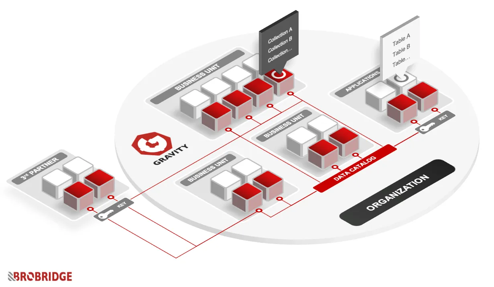

# Introduction

Welcome to the Official Gravity Documentation! Here you will find everything you need to know about the Gravity! 
Introducing Gravity: A cutting-edge Data Mesh product that seamlessly integrates Cloud-Native and Kubernetes-Native features, fostering Decentralized, Domain-Driven data management with Self-Serve Infrastructure and Interoperable Data Governance.

